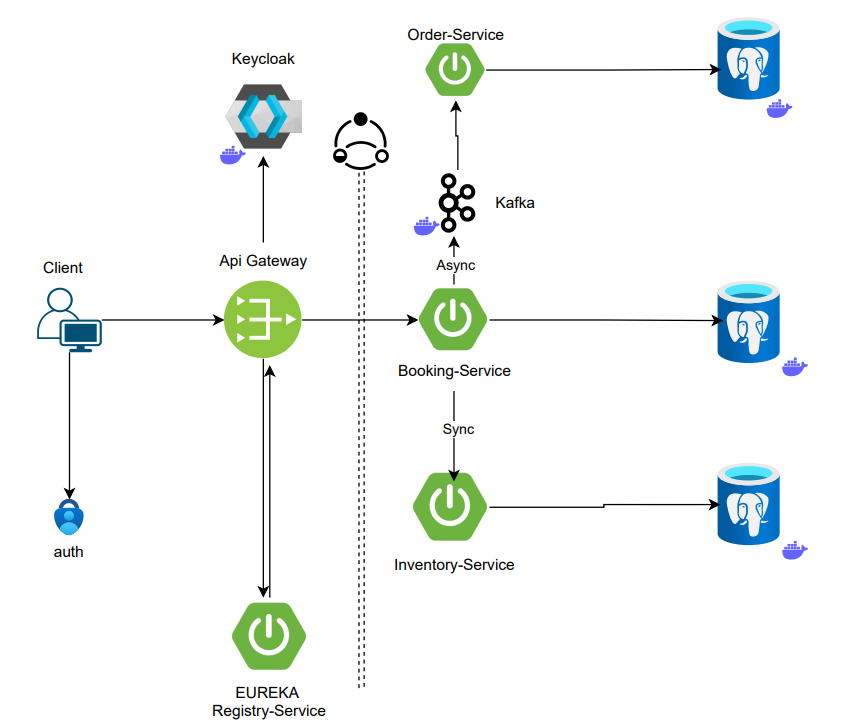

# 🎟️ Ticket Booking System - Microservices Architecture

This project is a **backend ticket booking system** built with **Spring Boot microservices**, implementing a modern, secure, and scalable architecture using:

- Spring Cloud Gateway
- Eureka Discovery Service
- Kafka (for asynchronous communication)
- PostgreSQL (for persistence)
- Keycloak (for authentication/authorization)
- Docker Compose (for orchestration)

---

## 📌 Architecture Overview

 

### Key Components:
| Service             | Description |
|---------------------|-------------|
| **API Gateway**     | Entry point for all client requests. Routes requests and handles security (via Keycloak). |
| **Eureka**          | Service registry for dynamic discovery of microservices. |
| **Keycloak**        | Identity and access management (IAM) provider for authentication and authorization. |
| **Booking Service** | Core logic for booking tickets. Interacts with Inventory Service synchronously and Order Service asynchronously via Kafka. |
| **Inventory Service** | Manages event capacities and updates stock after booking. |
| **Order Service**   | Processes and stores finalized orders. Listens to Kafka for booking events. |

---

## 🚀 Features

- ✅ User authentication with **Keycloak**
- ✅ API gateway routing & filtering
- ✅ Service registration/discovery with **Eureka**
- ✅ **Kafka-based async** event processing
- ✅ Synchronous communication using OpenFeign
- ✅ PostgreSQL for data persistence
- ✅ Dockerized microservices (`docker-compose.yml`)
- ✅ Modular code structure for each service
- ✅ Swagger API documentation (optional)
- ✅ Secure and scalable design

---

## 🧱 Tech Stack

- Java 17
- Spring Boot 3.x
- Spring Cloud Gateway
- Spring Security (with Keycloak)
- Spring Cloud Netflix Eureka
- Apache Kafka
- OpenFeign
- PostgreSQL
- Docker + Docker Compose

---

## 🛠️ How to Run the Project

### 1. Clone the Repository
```bash
git clone https://github.com/your-username/ticket-booking-sys.git
cd ticket-booking-sys


